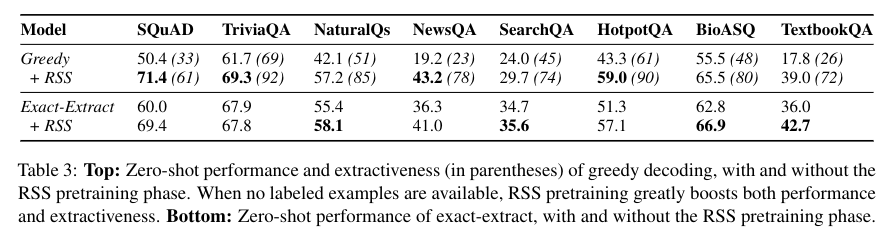

# Greedy Decoding Optimality

This repository contains the code and datasets discussed in our paper "[How Optimal is Greedy Decoding for Extractive Question Answering?](https://arxiv.org/abs/2108.05857)".

The fine-tuning is based on PyTorch (1.8.1) and Transformers (4.6.1), with a traininig\testing script based on Pytorch-Lightning (1.2.10), according to the requirements files [environment.yml](environment.yml).  

## Data
The few shot data is available in [data](data).

## Paper Correction - Table 3
There are some inaccuracies in Table 3 in the paper. 
SearchQA: Greedy (no RSS): should be 24.0 (45) instead of 17.8 (26).
HotpotQA and BioASQ numbers for Greedy (no rss) were swapped.
Some incorrect numbers rounding were introduced in table 3 as well.
The correct table is as follows:



## Exact-Extract code
The code for exact-extract algorithm can be found in [src/decoding/exact_extract.py](src/decoding/exact_extract.py).
It is written mainly for T5 as some assumptions are taken, such as the existence of ```<extra_id_0>``` and ```<extra_id_0>``` to be prepended and appended to each span. Most of the algorithm is implemented in ```mlspan_calc``` function, where the three functions mentioned in the paper - ```L```, ```l``` and ```e``` are realized as matrices.
\
If you wish to adapt it to some other encoder-decoder model (or even a decoder-only model) feel free to send an email (or.castel@cs.tau.ac.il).
Note that in its current implementation, and due to memory requirement of the algorithm, it is not batched across samples and as such it is slower than greedy decoding (but faster than a naive implementation).
## Fine-tuning

First, create a conda env and activate it 
```bash
conda env create -f ./fsspan/environment.yml
conda activate fsspan_env
```

Then finetune with:
```bash
python src/model.py 
    --batch_size=2 \
    --accumulate_grad_batches=2 \
    --splinter_data="./data" \
    --cache_dir="./cache" \
    --tags=comma_sep_nuptune_tags \
    --max_steps=512 \
    --optimizer=adafactor_const \
    --check_val_every_n_steps=0 \
    --train_samples=32 \
    --exp_name=some_name \
    --val_batch_size=16 \
    --model_name=google/t5-v1_1-large \
    --tokenizer=google/t5-v1_1-large \
    --log_every_n_steps=16 \
    --lr=5e-05 \
    --pattern='Text: <context> Question: <question> Answer:<mask>.' \
    --dataset=SQuAD \
    --seed=1 
    --check_val_every_n_epoch=9999 \ 
    --results_path=some_results_dir/results.jsonl \
    --test_samples=-1 \
    --num_nodes=1 \
    --gpus=8 \
    --accelerator=ddp \ 
    --decode_greedy \
    --decode_ml_span
```

If you wish to run on a single GPU, you should remove ```--accelerator``` flag and set ```gpus=1```.

### Useful parameters
dataset: ```HotpotQA```, ```NaturalQuestions```, ```NewsQA```, ```SQuAD``` ```SearchQA```, ```TriviaQA```, ```BioASQ```, ```TextBookQA```.
\
train_samples: ```16```, ```32```, ```64```, ```128```, ```256```, ```512```, ```1024``` and ```-1``` (for full training set)
\
seeds:  0-4
\
model_name/tokenizer: you can use anything that is T5 based, as current implementation assumes encoder-decoder and available ```<extra_id_0>``` and ```<extra_id_1>```.


To use the rss-pretrained model mentioned in the paper that achieves 71.4 F1 on zero-shot SQuAD, you can use the following:

## RSS zero shot 

In the paper we discuss a model finetuned on RSS dataset for enhancing its tendency towards extracting spans from the context (encoder input). It is now avaialble via HuggingFace models hub, with the name ```tau\t5-v1_1-large-rss```.
You can pass its name as a paramters. To get the SQuAD results, for instance, run:
```bash
python src/model.py 
    --batch_size=2 \
    --accumulate_grad_batches=2 \ 
    --splinter_data="./data" \
    --cache_dir="./cache" \
    --tags=comma_sep_nuptune_tags \
    --max_steps=0 \
    --optimizer=adafactor_const \
    --check_val_every_n_steps=0 \
    --train_samples=0 \
    --exp_name=some_name \
    --val_batch_size=16 \
    --model_name=tau/t5-v1_1-large-rss \ 
    --tokenizer=tau/t5-v1_1-large-rss \
    --log_every_n_steps=16 \
    --lr=5e-05 \
    --pattern='Text: <context> Question: <question> Answer:<mask>.' \
    --dataset=SQuAD \
    --seed=0 \
    --check_val_every_n_epoch=9999 \ 
    --results_path=some_results_dir/results.jsonl \
    --test_samples=-1 \ 
    --num_nodes=1 \
    --gpus=4 \
    --accelerator=ddp \ 
    --decode_greedy \
    --decode_ml_span 
```

The model was trained to predict a single masked span, without any pattern used in training. The pattern is only introduced in the MRQA datasets finetuning and inference phases. This means that if you choose to use this model, you don't need to assume it was 
trained with some pattern.
## Citation

If you find this work helpful, please cite us:
```
@misc{castel2021optimal,
      title={How Optimal is Greedy Decoding for Extractive Question Answering?}, 
      author={Or Castel and Ori Ram and Avia Efrat and Omer Levy},
      year={2021},
      eprint={2108.05857},
      archivePrefix={arXiv},
      primaryClass={cs.CL}
}
```


If you are using the RSS model or referring to it's pretraining scheme, please also cite the paper that introduced it:
```
@inproceedings{ram-etal-2021-shot,
    title = "Few-Shot Question Answering by Pretraining Span Selection",
    author = "Ram, Ori  and
      Kirstain, Yuval  and
      Berant, Jonathan  and
      Globerson, Amir  and
      Levy, Omer",
    booktitle = "Proceedings of the 59th Annual Meeting of the Association for Computational Linguistics and the 11th International Joint Conference on Natural Language Processing (Volume 1: Long Papers)",
    month = aug,
    year = "2021",
    address = "Online",
    publisher = "Association for Computational Linguistics",
    url = "https://aclanthology.org/2021.acl-long.239",
    pages = "3066--3079",
}
```

